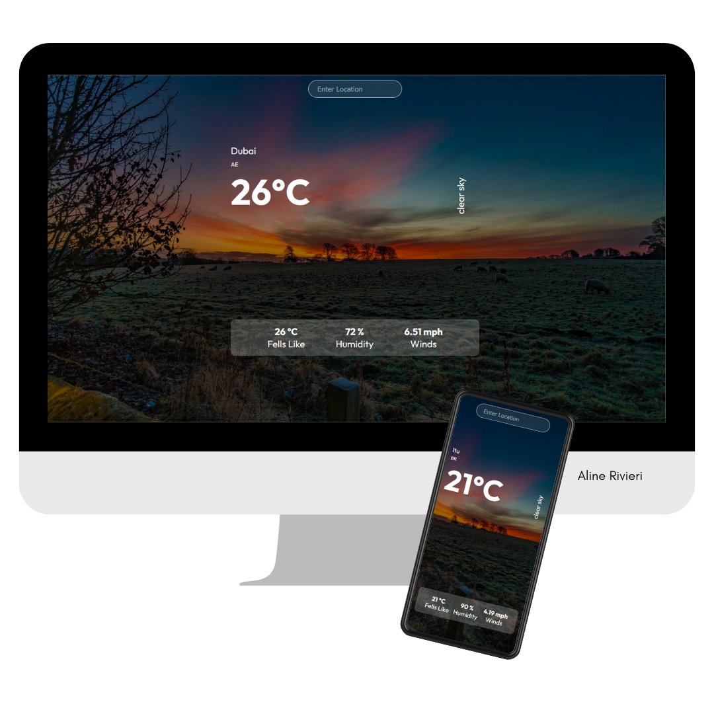

# Weather App

Is an application to access weather data from the API: https://openweathermap.org/api

⚒️ Technologies used:

- HTML
- CSS
- ReactJS
- API 

🤓 Learning:

- Using the concept of API, useState.

📄 Requirements:

- Any operating system
- VS Code

📝 License:

-Free for use and change

💻 Result:

Veja a aplicação [AQUI](https://weather-app-lovat-rho.vercel.app/)
